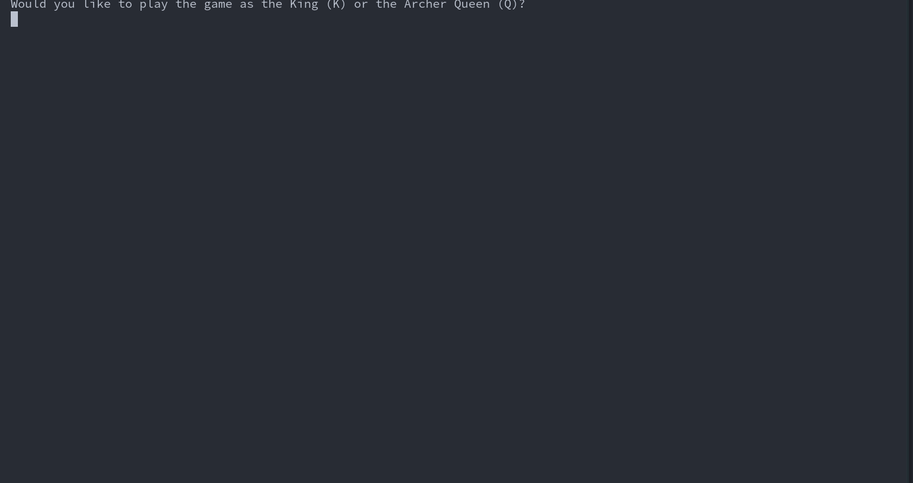
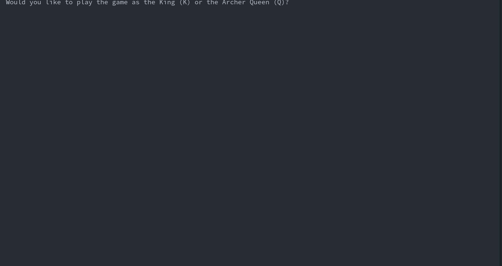

# Wrath-Of-Ares

Welcome to Wrath of Ares, a gripping Python CLI game that draws inspiration from the legendary Clash of Clans! Embark on an epic journey, taking on the roles of either the valiant King or the formidable Queen. Each ruler boasts unique abilities, adding depth and excitement to your gameplay experience.

Unleash your wrath with the King's dual attack options: a close-range, high-damage sword strike (`<space>`) or a devastating area-of-effect (AOE) assault (`<q>`). Alternatively, harness the Queen's power through her relentless AOE arrow rain attack (`<space>`), keeping your foes at bay from a distance.



## Map Loader

Design custom maps effortlessly using ASCII, immersing yourself in a world of endless strategic possibilities. Strategically defend your village with the placement of powerful cannons and wizard towers. Command your troops from three distinct spawn points, comprising Barbarians, Archers, and Balloons.

This is how level 3 is designed for example :) Check out [this document](maps/README.md) for more instructions on how to design your own maps!
```
.............................................................................................................................
.K...........................................................................................................................
................................................1............................................................................
.............................................................................................................................
.....................###########################################################################.............................
....................##................C............C...........................................##............................
...........##########...........................................................................##...........................
...........#...................C....................................................W--..........##..........................
...........#..............................T---......................................---.........##...........................
...........#..............................----................C.....................---........##............................
..........##...W--............C...........----......................................---........#.............................
.........##....---........................----..........................H----.......---........#.............................
.......###.....---......................................................-----..................#.....2.......................
.......#.......---........................................C....................................#.............................
.......#.......---..................C.......................................H----....C....######.............................
.......#...............C......................C...............W--...........-----.........#..................................
.......#......................................................---........................##..................................
.......################......H----............................---..................#######...................................
......................##.....-----............................---..................#.........................................
.......................##.....................................---..................#.........................................
........................##########............H----............................#####.........................................
.................................#............-----..........C.................#.............................................
.................................#.....H----................................####.............................................
.................................##....-----........H----...................#................................................
..................................##................-----...................#................................................
...........3.......................##########################################................................................
.............................................................................................................................
.............................................................................................................................
.............................................................................................................................
.............................................................................................................................
```

## Troops
As the commander, you can deploy troops from three spawn points. 
Choose from three types of troops: Barbarians, Archers, and Balloons. 
1. Barbarians excel in close-range ground combat, delivering powerful blows to enemies within their reach. 
2. Archers showcase their marksmanship by firing over walls and structures with remarkable speed.
3. Balloons take to the skies, unleashing destruction from above and prioritizing the elimination of defensive structures. 
Neither Archer nor Barbarian can go over the walls. Adapt your tactics wisely, as the number of troops at your disposal are limited. 

## Config
Tailor the game to your preferences by effortlessly customizing settings in `utils/config.py`. You can simply change the constants in this file to tweak the game to your liking.
```python
...
MODERATE_DMG_COLOR = Fore.YELLOW
CRITICAL_DMG_COLOR = Fore.RED
DAMAGE_TICK_COLOR = Fore.LIGHTRED_EX

BG_COLOR = Back.LIGHTGREEN_EX
WALL_COLOR = Fore.WHITE
HUT_COLOR = Fore.BLACK
BALLOON_COLOR = Fore.LIGHTBLUE_EX
ARCHER_COLOR = Fore.YELLOW
SPAWNPOINT_COLOR = Fore.MAGENTA
ASCII_LOSE_COLOR = Fore.RED
ASCII_WIN_COLOR = Fore.GREEN

KING_SPEED = 1
KING_COLOR = Fore.BLACK
QUEEN_COLOR = Fore.BLACK

CANNON_COLOR = Fore.BLACK
CANNON_FDELAY = 10
CANNON_HEALTH = 50
CANNON_RANGE = 5
...
```

## Replays!
Relive the intensity by revisiting recorded replays stored in replays/ whenever you desire. Replays are automatically stored in `replays/`. Only the last 10 replays will be stored. You can play a replay using the command `python3 replay.py <replay_id>`.

Prepare yourself for an adrenaline-pumping adventure, as Wrath of Ares invites you to seize victory and dominate the battlefield! Immerse yourself in a world where strategic prowess meets thrilling action, shaping the fate of your kingdom and carving your name in the annals of history. Are you ready to unleash the Wrath of Ares? The battlefield awaits your command!

## More Gameplay :)



## How to play?
1. Clone the repo
2. Start the game using `python3 play.py`
3. Press x to quit